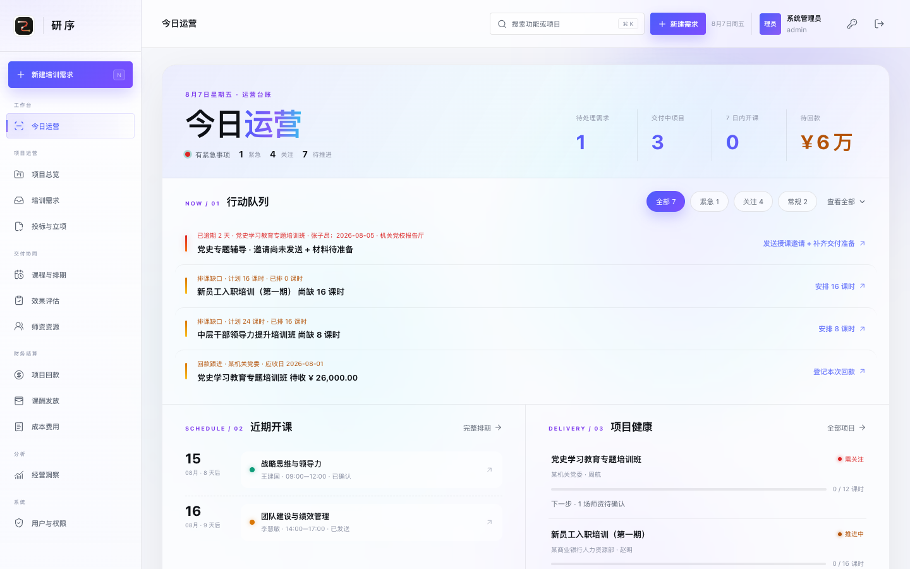
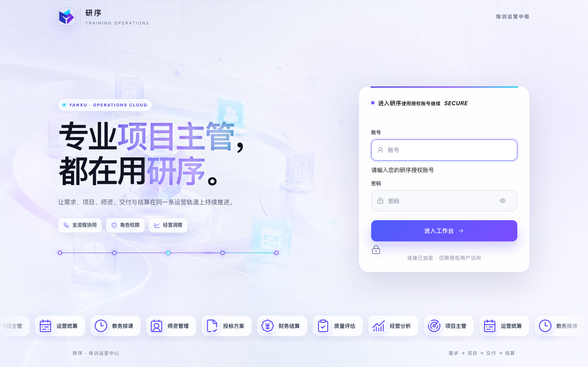
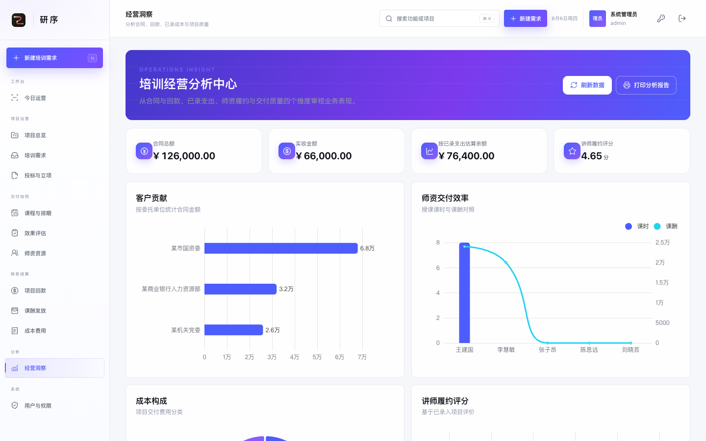
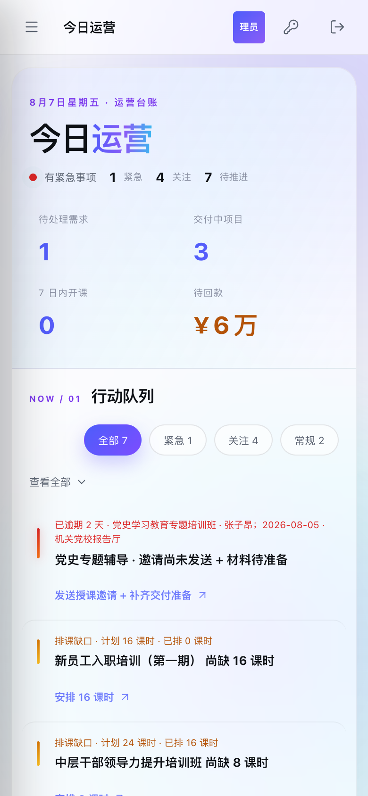

# 研序 · 培训运营中心（Yanxu Training OS）

覆盖培训公司完整业务链的全流程运营平台：需求 → 投标立项 → 项目 → 师资排课 → 交付 → 评估 → 回款 → 课酬 → 成本 → 归档。

刻意保持**无框架、无构建**：单个 Java 17 进程（JDK 内置 HttpServer + 嵌入式 H2）服务一个原生 JavaScript 单页应用。部署即一个静态目录 + 一个进程。

> English docs: [README.md](README.md)

## 亮点

- **运营驾驶舱（今日运营）**：单一连续玻璃面指挥台——按逾期、开课临近、排课缺口、材料就绪与回款节点自动排列行动队列，支持严重度筛选（全部/紧急/关注/常规）、按天分组的开课时间线、项目健康进度条与经营快照带。
- **V10 展示型科技视觉**：保留既有紫蓝科技风，在登录首屏使用新的 ImageGen 科技轨道 Hero 与透明 PNG 品牌 Logo，并以独立 `v10.css` 完成桌面、平板和手机适配。
- **公开培训资料中心**：首页左上角提供免登录入口，外部访客可下载已上架学习包；系统管理员和业务管理员均可上传、编辑、上下架和删除资料，并查看下载次数。
- **项目工作区**：风险优先视图，阻塞与提醒按业务记录合并并直达待处理行；完成交付与归档由真实闭环校验把关。
- **三种角色**：系统管理员 / 业务管理员 / 只读用户，服务端逐接口强制执行，界面同步隐藏写入口。
- **效果评估**：草稿 → 发布 → 匿名作答链接 → 实时统计（评分分布、单选图表、文本反馈）→ 关闭。
- **算得清的账**：课酬按已确认课时 × 标准自动核算并防重复生成；回款支持部分收款与结清；成本汇入估算余额。
- **响应式与可访问性**：桌面 / 平板 / 手机三套布局，键盘导航、焦点管理、尊重 `prefers-reduced-motion`。
- **现代认证与接口边界**：HttpOnly Cookie 会话、PBKDF2 密码散列及旧哈希兼容迁移；写接口严格限制方法、JSON 类型、有限数值与业务状态机。
- **回归套件**：52 项 API 端到端 + 93 项业务完整性与安全检查，只允许在全新 loopback 隔离库运行。

## 快速开始

环境：Java 17+（仅跑回归套件时需要 Node 18+）。

```bash
./run.sh --demo     # Mac / Linux；Windows 用 run.bat
```

打开 <http://localhost:8080>。演示模式在全新隔离的 `demo-data/` 库中注入示例数据与体验账号：

| 角色 | 账号 | 密码 |
|---|---|---|
| 系统管理员 | `admin` | `admin123` |
| 业务管理员 | `manager` | `manager123` |
| 只读用户 | `viewer` | `viewer123` |

不带 `--demo` 启动为正式模式（`data/` 目录），不创建任何默认账号或示例数据。

## 持续维护

每次发布都必须重新编译 Java 17 后端，并在两套相互隔离、仅绑定 loopback 的临时数据库上执行全部 145 项回归。正式数据和正式凭据不会进入该质量门禁。涉及安全边界的改动还应同步更新 `docs/SECURITY.md` 与 `CHANGELOG.md`。

## 界面一览






以上截图均来自仓库自带的隔离演示数据，不包含正式业务记录或正式凭据。

## 文档

- [docs/ARCHITECTURE.md](docs/ARCHITECTURE.md) — 接口分组、工作流规则与部署拓扑
- [docs/SECURITY.md](docs/SECURITY.md) — 认证、会话、权限与发布安全模型
- [CHANGELOG.md](CHANGELOG.md) — 设计演进：Ledger V4 → 展示型科技视觉 V10
- [CONTRIBUTING.md](CONTRIBUTING.md) — 贡献约定

## 许可证

[MIT](LICENSE)
